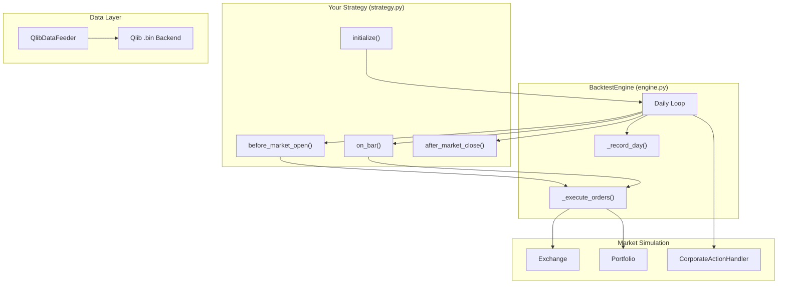

# Event-Driven Backtester Guide

A complete reference for building robust, realistic A-share strategies with the `EventDrivenBacktester`.

> [!IMPORTANT]
> This guide covers the **event-driven** engine (`src/backtest_engine/event_driven/`). For rapid factor screening and ML signal evaluation, see the [Vectorized Backtesting Guide](signal_backtesting_guide.md).

---

## 1. Architecture Overview



### Daily Lifecycle

Each trading day proceeds through **3 phases**:

| Phase | Method | Data Visible | Orders Fill At |
|-------|--------|--------------|----------------|
| Pre-market | `before_market_open(ctx)` | Previous day only (`ctx.prev_day_data`) | Today's **OPEN** |
| On-bar | `on_bar(ctx)` | Full today's OHLCV (`ctx.day_data`) | Today's **CLOSE** |
| After-close | `after_market_close(ctx)` | Full day data | No orders allowed |

### Dual-Price Architecture

The engine maintains **two price views** in `ctx.day_data`:

| Column | Purpose | Used By |
|--------|---------|---------|
| `open`, `close`, `high`, `low` | Signal computation (momentum, MA, factors) | Strategy code |
| `raw_open`, `raw_close`, `raw_high`, `raw_low` | Order execution, portfolio valuation | Engine internals |

> [!NOTE]
> Our Qlib backend currently stores raw (unadjusted) prices, so `raw_close == close`. The separation exists as infrastructure for backends that apply forward adjustment.

---

## 2. Quick Start

### Minimal Strategy

```python
import sys, os
sys.path.insert(0, os.path.abspath(os.path.join(os.path.dirname(__file__), '..', '..')))

import logging
import pandas as pd
from src.backtest_engine.event_driven import (
    EventDrivenBacktester, Strategy, Order, BacktestContext,
    CostConfig, FixedSlippage,
)

logger = logging.getLogger(__name__)

class BuyAndHoldCSI300(Strategy):
    """Buy top 10 CSI300 stocks by market cap, hold for 20 days."""

    def initialize(self, ctx: BacktestContext) -> None:
        self.g.hold_num = 10
        self.g.rebalance_interval = 20
        self.g.day_count = 0

    def before_market_open(self, ctx: BacktestContext) -> list[Order]:
        self.g.day_count += 1
        if (self.g.day_count - 1) % self.g.rebalance_interval != 0:
            return []

        # Get CSI300 universe (PIT-correct)
        universe = ctx.feeder.get_index_constituents(
            'csi300', ctx.feeder.get_prev_trading_day(ctx.date)
        )

        # Fetch market cap from Qlib
        prev_date = ctx.feeder.get_prev_trading_day(ctx.date)
        features = ctx.feeder.get_features(
            universe, ['$total_mv'], prev_date, prev_date
        )
        if features.empty:
            return []

        # Rank by market cap (descending)
        features = features.reset_index()
        features = features.dropna(subset=['$total_mv'])
        ranked = features.nlargest(self.g.hold_num, '$total_mv')
        target_codes = ranked['instrument'].tolist()

        # Generate orders
        orders = []
        # Sell positions not in target
        for code in list(ctx.portfolio.positions.keys()):
            if code not in target_codes:
                orders.append(Order(code, 'sell', reason='rebalance'))

        # Buy target positions with equal weight
        held = [c for c in target_codes if c in ctx.portfolio.positions]
        to_buy = [c for c in target_codes if c not in ctx.portfolio.positions]
        if to_buy:
            per_stock = ctx.portfolio.total_value({}) / self.g.hold_num
            for code in to_buy:
                orders.append(Order(code, 'buy',
                                    target_value=per_stock,
                                    reason='rebalance'))
        return orders


if __name__ == '__main__':
    logging.basicConfig(level=logging.INFO,
                        format='%(asctime)s %(levelname)s %(message)s')

    bt = EventDrivenBacktester(data_dir='e:/量化系统/data')
    result = bt.run(
        strategy=BuyAndHoldCSI300(),
        start_time='2024-01-01',
        end_time='2024-12-31',
        benchmark='000300.SH',
        account=1_000_000,
        exchange_config=CostConfig(),
        slippage=FixedSlippage(0.02),
        preload_fields=[
            '$open', '$close', '$high', '$low', '$vol',
            '$amount', '$pre_close', '$total_mv',
        ],
    )

    # Print results
    print(pd.Series(result.summary).to_string())
    result.trades.to_csv('trades.csv', index=False)
```

---

## 3. Key Components Reference

### 3.1 EventDrivenBacktester

The high-level API that wires everything together:

```python
bt = EventDrivenBacktester(data_dir='e:/量化系统/data')
result = bt.run(
    strategy=MyStrategy(),       # Your Strategy subclass
    start_time='2024-01-01',     # Backtest start
    end_time='2024-12-31',       # Backtest end
    benchmark='000300.SH',       # Benchmark index code
    account=200_000,             # Initial capital ¥
    exchange_config=CostConfig(  # ← CUSTOMIZE
        buy_commission=0.00025,  # 0.025%
        sell_commission=0.00025,
        stamp_tax=0.0005,        # 0.05% (post 2023-08-28)
        min_commission=5.0,      # ¥5 minimum
    ),
    slippage=FixedSlippage(0.02), # ¥0.02 per share
    volume_limit=0.25,            # Max 25% of daily volume
    preload_fields=[              # ← MUST include all Qlib fields used
        '$open', '$close', '$high', '$low', '$vol',
        '$amount', '$pre_close',
        '$total_mv', '$turnover_rate',   # ← your factor fields
    ],
)
```

> [!CAUTION]
> Every Qlib `$field` you access via `ctx.feeder.get_features()` **must** be listed in `preload_fields`. Missing fields cause cache misses and slow D.features() fallback calls.

### 3.2 Order

```python
Order(
    code='600519.SH',    # Tushare ts_code
    direction='buy',     # 'buy' or 'sell'
    target_value=50000,  # Spend ¥50,000 (for buys)
    target_shares=None,  # Sell N shares (for sells, None=sell all)
    reason='rebalance',  # Audit trail string
)
```

**Execution rules:**
- Sells execute before buys (to free cash)
- Buy shares are rounded down to lot size (100 shares)
- Volume capped at `volume_limit` × daily volume
- Limit-up stocks cannot be bought; limit-down stocks cannot be sold
- Suspended stocks (vol=0) are skipped entirely
- T+1: newly bought shares are only sellable the next trading day

### 3.3 BacktestContext

Available inside your strategy methods:

| Attribute | Type | Description |
|-----------|------|-------------|
| `ctx.date` | `pd.Timestamp` | Current trading date |
| `ctx.prev_day_data` | `DataFrame` | Yesterday's OHLCV for all stocks |
| `ctx.day_data` | `DataFrame` | Today's OHLCV (only in `on_bar`) |
| `ctx.day_data_indexed` | `DataFrame` | Today's data indexed by `ts_code` |
| `ctx.portfolio` | `Portfolio` | Current positions, cash, value |
| `ctx.exchange` | `Exchange` | Tradability checks, cost computation |
| `ctx.feeder` | `QlibDataFeeder` | Feature queries, calendar, constituents |
| `ctx.trading_day_index` | `int` | 0-based day counter |
| `ctx.total_days` | `int` | Total trading days in backtest |
| `ctx.phase` | `str` | `'pre_open'`, `'on_bar'`, or `'after_close'` |

### 3.4 BacktestResult

```python
result.report           # Daily portfolio-level DataFrame
result.trades           # Every executed trade
result.order_log        # All orders (including blocked)
result.daily_holdings   # Per-stock daily positions
result.corporate_actions # Dividends and bonus shares
result.equity_curve     # Normalized equity series (starts at 1.0)
result.summary          # Dict of 21 JQ-compatible metrics
```

---

## 4. Strategy Design Patterns

### 4.1 Periodic Rebalancing

```python
def initialize(self, ctx):
    self.g.day_count = 0
    self.g.rebalance_interval = 10  # every 10 trading days

def before_market_open(self, ctx):
    self.g.day_count += 1
    if (self.g.day_count - 1) % self.g.rebalance_interval != 0:
        return []
    # ... rebalance logic ...
```

### 4.2 Factor-Based Stock Selection

```python
def _select_stocks(self, ctx):
    """Select top-N stocks by composite factor score."""
    prev_date = ctx.feeder.get_prev_trading_day(ctx.date)
    universe = ctx.feeder.get_index_constituents('csi300', prev_date)

    # Fetch multiple factors
    fields = ['$total_mv', '$turnover_rate']
    features = ctx.feeder.get_features(universe, fields, prev_date, prev_date)
    if features.empty:
        return []

    df = features.reset_index()
    df = df.dropna(subset=fields)

    # Cross-sectional Z-score ranking
    for f in fields:
        df[f'{f}_rank'] = df[f].rank(pct=True)

    # Composite: small cap + high turnover
    df['score'] = (1 - df['$total_mv_rank']) + df['$turnover_rate_rank']
    return df.nlargest(6, 'score')['instrument'].tolist()
```

### 4.3 Tradability-Aware Selling

```python
def _generate_sell_orders(self, ctx, target_codes):
    """Sell positions not in target, respecting exchange rules."""
    orders = []
    prev_indexed = ctx.prev_day_data.set_index('ts_code')

    for code in list(ctx.portfolio.positions.keys()):
        if code in target_codes:
            continue
        # Skip stocks that were limit-up yesterday (can't sell today)
        if code in prev_indexed.index:
            prev_date = ctx.feeder.get_prev_trading_day(ctx.date)
            row = prev_indexed.loc[code]
            if ctx.exchange.is_limit_up(row, code, prev_date):
                continue  # keep position, try next rebalance
        orders.append(Order(code, 'sell', reason='rebalance'))
    return orders
```

### 4.4 Momentum with Lookback

```python
def _compute_momentum(self, ctx, stocks, lookback=20):
    """Compute N-day momentum using feeder price history."""
    prev_date = ctx.feeder.get_prev_trading_day(ctx.date)

    # Fetch lookback+1 days of closing prices
    cal = ctx.feeder.get_trading_calendar(
        (prev_date - pd.Timedelta(days=lookback * 2)).strftime('%Y-%m-%d'),
        prev_date.strftime('%Y-%m-%d')
    )
    # Use the last lookback+1 days
    start = cal[-(lookback + 1)] if len(cal) > lookback else cal[0]

    prices = ctx.feeder.get_features(stocks, ['$close'], start, prev_date)
    if prices.empty:
        return {}

    # Compute return over lookback period per stock
    momentum = {}
    for code in stocks:
        if code in prices.index.get_level_values('instrument'):
            sub = prices.loc[code, '$close'].dropna()
            if len(sub) >= lookback + 1:
                momentum[code] = sub.iloc[-1] / sub.iloc[-(lookback + 1)] - 1
    return momentum
```

---

## 5. Preloading & Performance

### Field Preloading (Critical)

The engine calls `feeder.preload_features()` once before the backtest starts, loading ALL requested fields into memory. This makes per-day `get_features()` calls O(1) cache lookups.

```python
preload_fields = [
    # Engine execution fields (auto-included)
    '$open', '$close', '$high', '$low', '$vol', '$amount', '$pre_close',
    # $adj_factor is auto-included by data_feeder

    # Your factor fields (MUST be listed here)
    '$total_mv',           # Market cap
    '$turnover_rate',      # Turnover
    '$circ_mv',            # Circulating market cap
    '$pe_ttm',             # P/E TTM
    '$pb',                 # P/B
    '$n_income_attr_p',    # Net income (PIT-correct fundamental)
    '$revenue_q',          # Single-quarter revenue
]
```

> [!WARNING]
> If you include fundamental fields (e.g., `$n_income_attr_p`), they are already PIT-correct via the Qlib backend's `ann_date` + `shift(1)` alignment. **Do NOT** apply additional PIT logic in your strategy.

### Performance Characteristics

| Config | 1-Year Backtest | Memory |
|--------|----------------|--------|
| 7 price fields, CSI300 | ~25 seconds | ~200 MB |
| 15 fields (with fundamentals) | ~30 seconds | ~400 MB |
| Without preloading | ~5+ minutes | ~50 MB |

---

## 6. A-Share Exchange Rules

The `Exchange` module enforces these automatically:

| Rule | Behavior |
|------|----------|
| **T+1** | Shares bought today cannot be sold until tomorrow |
| **Lot size** | Buy/sell rounded to 100 shares |
| **Limit-up** | Close ≥ pre_close × (1+limit%) → cannot buy |
| **Limit-down** | Close ≤ pre_close × (1-limit%) → cannot sell |
| **Suspension** | Volume = 0 → all orders blocked |
| **IPO period** | No limit enforcement during first 1-5 days |
| **Volume limit** | Max 25% of daily volume per order (configurable) |
| **Stamp tax** | Sell-only: 0.1% before 2023-08-28, 0.05% after |
| **Commission** | Both sides: 0.025% with ¥5 minimum |

### Price Limit Tiers

| Board | Code Prefix | Limit |
|-------|-------------|-------|
| Main Board | 000/001/002/003/600/601/603/605 | ±10% |
| ST stocks | Any | ±5% |
| ChiNext | 300/301 (post-2020-08-24) | ±20% |
| STAR | 688/689 | ±20% |
| BSE | 83/87/43/92 | ±30% |

---

## 7. Validation Checklist

Before trusting your backtest results, verify:

- [ ] **No lookahead bias**: Strategy only uses `ctx.prev_day_data` in `before_market_open()`, never `ctx.day_data`
- [ ] **All fields preloaded**: Every `$field` in `get_features()` calls is in `preload_fields`
- [ ] **Universe is PIT-correct**: Use `feeder.get_index_constituents(name, prev_date)` not hardcoded lists
- [ ] **Orders have reasons**: Every Order has a `reason` string for the audit trail
- [ ] **Cash management**: Estimated `per_stock` value accounts for existing positions
- [ ] **Limit-up awareness**: Stocks at limit-up yesterday are handled (skip buying or reduce allocation)
- [ ] **ST filtering**: Strategy excludes `ctx.exchange.is_st(code, date)` if desired
- [ ] **Sufficient capital**: Initial account ÷ hold_num gives enough per slot for lot-size rounding

### Cross-Platform Validation

To verify against JoinQuant:

1. Create identical strategy on both platforms (same factors, universe, rebalance schedule)
2. Compare Day 1 fill prices — should match exact to the fen (分)
3. Compare rebalance stock selections — expect >80% overlap with identical factors
4. Check trade count alignment per rebalance date
5. Reference scripts: `workspace/scripts/run_verified_validation.py` (local) and `workspace/scripts/jq_verified_validation.py` (JQ)

---

## 8. Common Pitfalls

| Pitfall | Consequence | Fix |
|---------|-------------|-----|
| Using `ctx.day_data` in `before_market_open()` | Lookahead bias — seeing today's prices before market opens | Use only `ctx.prev_day_data` |
| Forgetting to preload factor fields | 100× slower — falls back to per-day D.features() | Add all `$fields` to `preload_fields` |
| Not filtering suspended stocks | Orders silently blocked, cash sits idle | Pre-filter via `vol > 0` or let exchange handle it |
| Hardcoding universe | Survivorship bias | Use `feeder.get_index_constituents()` |
| Selling before checking `can_sell()` | Orders blocked by T+1, limit-down | Engine handles this, but log review shows BLOCKED |
| Using adjusted prices for momentum | Incorrect returns at stock splits/dividends | Use `$close * $adj_factor` / lagged `$adj_factor` for adjusted returns |
| Forgetting minimum commission | ¥5 minimum means small trades have high cost drag | Ensure `per_stock × commission > ¥5` |
